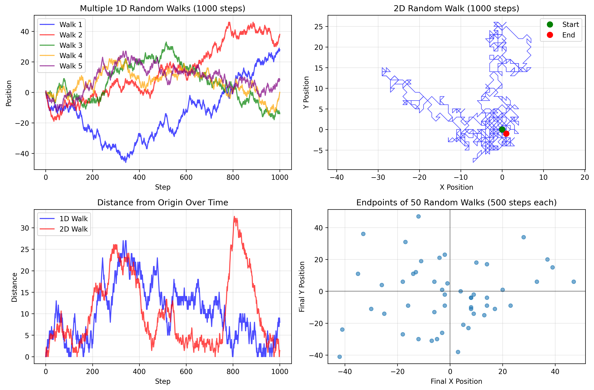
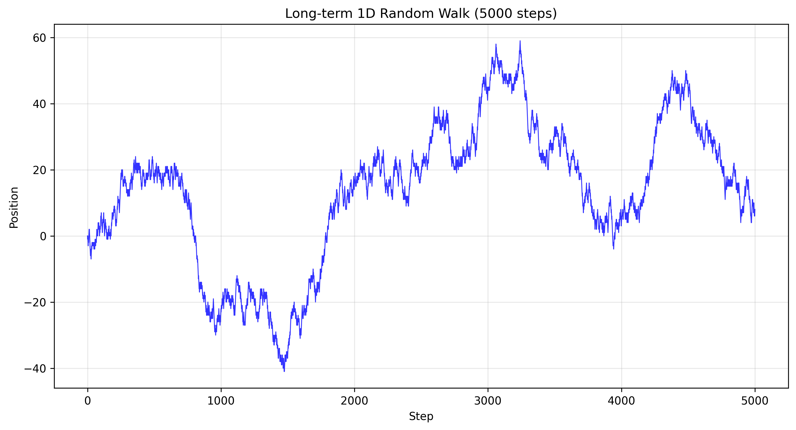
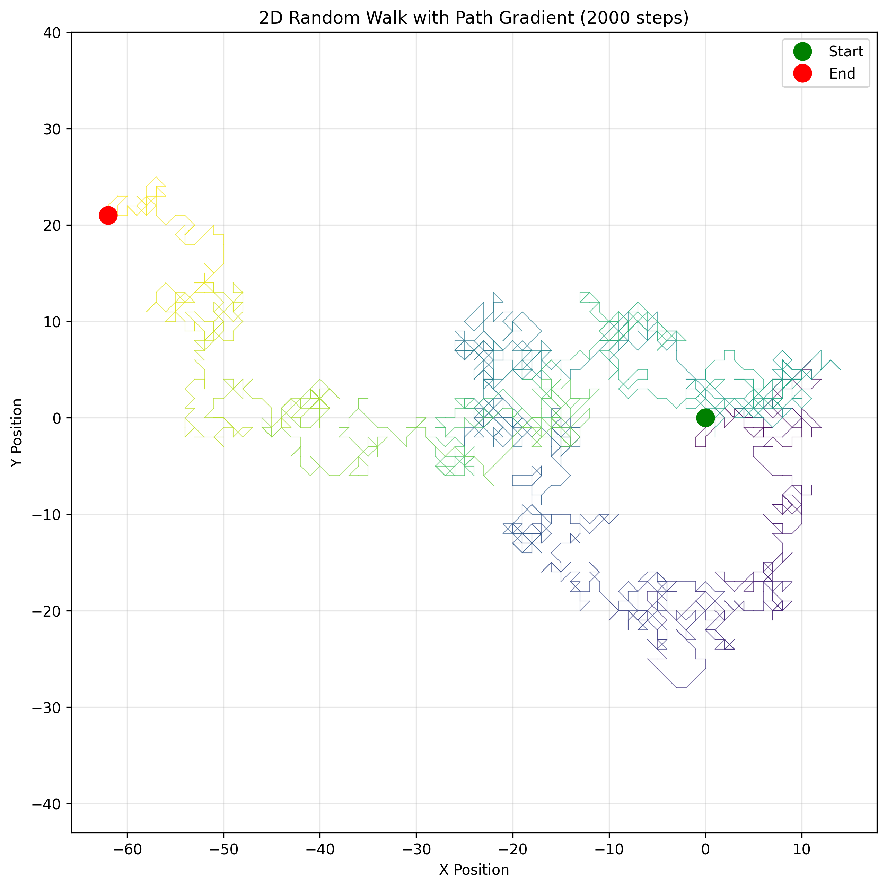
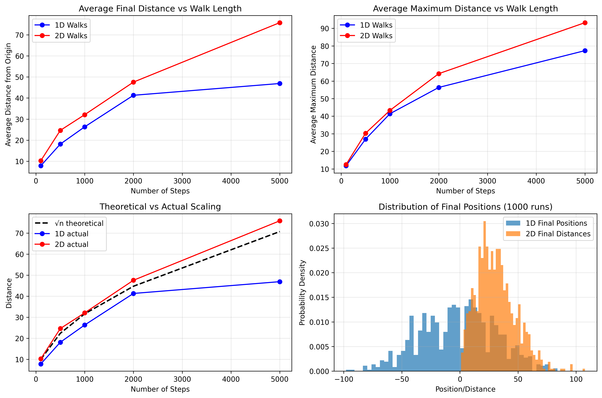
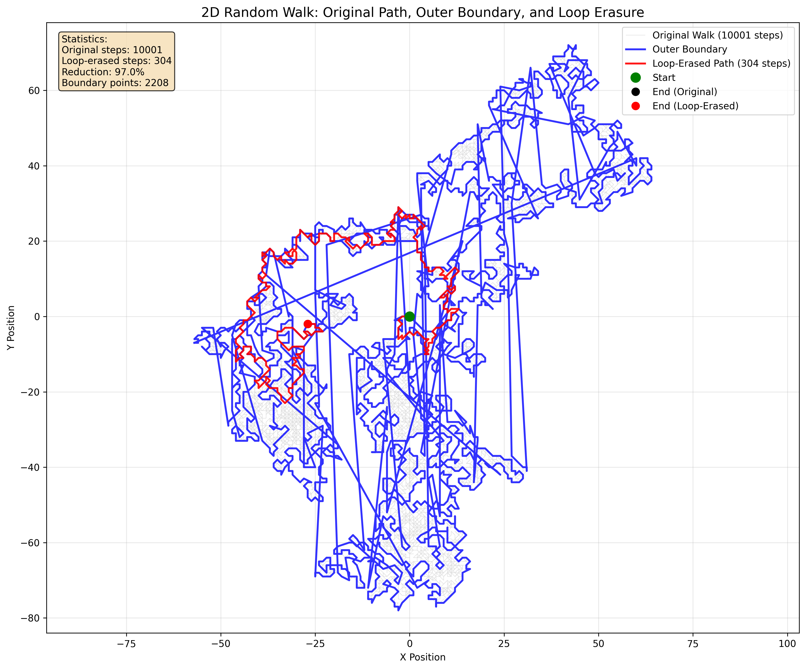

# Random Walk Simulations

A Python implementation of random walk algorithms with visualization capabilities.

## Overview

This project implements both 1D and 2D random walks with statistical analysis and matplotlib-based visualizations. Random walks are fundamental mathematical models used in physics, biology, economics, and computer science to describe processes that appear to move randomly.

## Features

- **1D Random Walk**: Simple one-dimensional movement with steps of +1 or -1
- **2D Random Walk**: Two-dimensional movement on Z² lattice with 4-connected nearest-neighbor steps
- **Statistical Analysis**: Distance metrics and position tracking
- **Visualization**: Matplotlib plots showing walk paths and trajectories
- **Modular Design**: Easy to extend and modify for different walk types

## Installation

1. Clone the repository:
```bash
git clone https://github.com/urikreitner/RWs.git
cd RWs
```

2. Create and activate a virtual environment:
```bash
python3 -m venv venv
source venv/bin/activate
```

3. Install dependencies:
```bash
pip install -r requirements.txt
```

## Usage

Run the basic simulation:
```bash
python random_walk.py
```

This will generate a 1000-step random walk in both 1D and 2D, display statistics, and create visualizations.

Generate comprehensive simulation images:
```bash
python generate_simulations.py
```

This creates detailed visualization images saved in the `images/` directory.

Generate loop-erased random walk visualization:
```bash
python loop_erased_walk.py
```

This creates a visualization showing the original walk, convex hull boundary, and loop-erased path.

## Simulation Results

### Multiple Random Walk Comparison


The above image shows:
- Multiple 1D random walks over 1000 steps
- A detailed 2D random walk trajectory  
- Distance from origin over time comparison
- Distribution of endpoints from 50 different walks

### Long-term Behavior


A 5000-step 1D random walk demonstrating long-term drift and return behavior.

### Complex 2D Visualization


A 2000-step 2D random walk with color gradient showing the progression from start (green) to end (red).

### Statistical Analysis


Comprehensive statistical analysis including:
- Average final distance vs walk length
- Theoretical √n scaling comparison
- Distribution of final positions

### Loop-Erased Random Walk


This visualization demonstrates loop erasure on a 2D random walk, showing:
- **Gray path**: Original random walk (10,000+ steps)
- **Blue boundary**: True outer boundary using facial walk algorithm (O(N) linear time)
- **Red path**: Loop-erased walk (~300 steps, 97% reduction)
- Loop erasure removes all cycles, creating a self-avoiding path from start to end

The outer boundary uses the "right-hand rule" facial walk algorithm from SLE research - the same method used to study Brownian frontiers and SLE₈/₃ processes. This linear-time algorithm traces the boundary of the unbounded face in the planar graph formed by the walk, giving the mathematically correct outer frontier. Loop-erased random walks are important in probability theory and have connections to uniform spanning trees and the Laplacian random walk.

## Example Output

The program outputs statistics such as:
- Final position after N steps
- Distance from origin
- Maximum distance reached during the walk

Sample output:
```
1D Random Walk after 1000 steps:
Final position: 40
Distance from origin: 40
Maximum distance from origin: 42

2D Random Walk after 1000 steps:
Final position: (-35, 15)
Distance from origin: 38.08
```

## Dependencies

- Python 3.6+
- matplotlib
- numpy

## Theory

Random walks are mathematical formalizations of paths consisting of a succession of random steps. They have applications in:

- **Physics**: Brownian motion, diffusion processes
- **Biology**: Animal foraging patterns, molecular movement
- **Economics**: Stock price modeling
- **Computer Science**: Algorithm analysis, network protocols

## License

This project is open source and available under the MIT License.