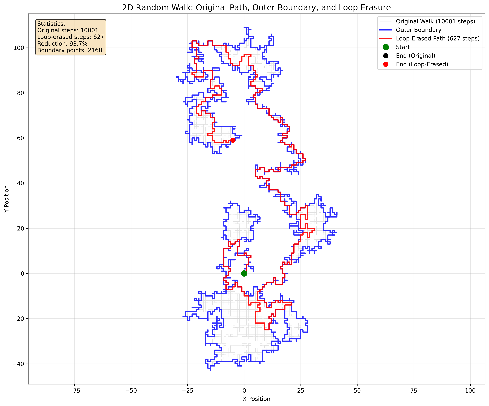

# Random Walk Simulations

A Python implementation of random walk algorithms with visualization capabilities.

## Overview

This project implements multiple types of random processes on lattices with comprehensive statistical analysis and visualization. Features include random walks, loop-erased walks, self-avoiding walks, and critical percolation with fractal dimension analysis. These are fundamental mathematical models used in physics, biology, economics, and computer science to study scaling behavior and critical phenomena.

## Features

- **1D Random Walk**: Simple one-dimensional nearest-neighbor movement with steps of +1 or -1
- **2D Random Walk**: Two-dimensional nearest-neighbor movement on Z² lattice with 4-connected steps
- **Loop-Erased Random Walk**: Implementation with outer boundary detection using facial walk algorithm
- **Self-Avoiding Walk**: Non-intersecting walks on Z² with scaling analysis (ν ≈ 3/4)
- **Critical Percolation**: Hexagonal lattice percolation at p_c = 1/2 with separating path analysis
- **Brownian Excursion**: Upper half-plane excursions with 3D Bessel process and scaling analysis
- **Statistical Analysis**: Distance metrics, position tracking, and Hausdorff dimension estimation
- **Visualization**: Matplotlib plots showing walk paths, trajectories, and scaling behavior
- **Modular Design**: Easy to extend and modify for different walk types

## Installation

1. Clone the repository:
```bash
git clone https://github.com/urikreitner/RWs.git
cd RWs
```

2. Create and activate a virtual environment:
```bash
python3 -m venv venv
source venv/bin/activate
```

3. Install dependencies:
```bash
pip install -r requirements.txt
```

## Usage

Run the basic simulation:
```bash
python random_walk.py
```

This will generate a 1000-step nearest-neighbor random walk in both 1D and 2D, display statistics, and create visualizations.

Generate comprehensive simulation images:
```bash
python generate_simulations.py
```

This creates detailed visualization images saved in the `images/` directory.

Generate loop-erased random walk visualization:
```bash
python loop_erased_walk.py
```

This creates a visualization showing the original walk, outer boundary, and loop-erased path.

Run Hausdorff dimension analysis:
```bash
python hausdorff_dimension.py
```

This performs scaling analysis on random walks with lengths from 256 to 32,768 steps to estimate Hausdorff dimensions.

Generate critical percolation on hexagonal lattice:
```bash
python hexagonal_percolation.py
```

This creates critical percolation at p_c = 1/2 and analyzes the separating path with fractal dimension ≈ 7/4.

Generate self-avoiding walks:
```bash
python self_avoiding_walk.py
```

This creates self-avoiding walks on Z² and analyzes their scaling properties with critical exponent ν ≈ 3/4.

Generate Brownian excursions in upper half-plane:
```bash
python brownian_excursion.py
```

This simulates excursions where x-axis follows Brownian motion and y-axis follows 3D Bessel process.

## Simulation Results

### Multiple Random Walk Comparison


The above image shows:
- Multiple 1D random walks over 1000 steps
- A detailed 2D random walk trajectory  
- Distance from origin over time comparison
- Distribution of endpoints from 50 different walks

### Long-term Behavior


A 5000-step 1D random walk demonstrating long-term drift and return behavior.

### Complex 2D Visualization


A 2000-step 2D random walk with color gradient showing the progression from start (green) to end (red).

### Statistical Analysis


Comprehensive statistical analysis including:
- Average final distance vs walk length
- Theoretical √n scaling comparison
- Distribution of final positions

### Loop-Erased Random Walk


This visualization demonstrates loop erasure on a 2D random walk, showing:
- **Gray path**: Original random walk (10,000+ steps)
- **Blue boundary**: True outer boundary using facial walk algorithm (O(N) linear time)
- **Red path**: Loop-erased walk (~300 steps, 97% reduction)
- Loop erasure removes all cycles, creating a self-avoiding path from start to end

The outer boundary uses the "right-hand rule" facial walk algorithm from SLE research - the same method used to study Brownian frontiers and SLE₈/₃ processes. This linear-time algorithm traces the boundary of the unbounded face in the planar graph formed by the walk, giving the mathematically correct outer frontier. Loop-erased random walks are important in probability theory and have connections to uniform spanning trees and the Laplacian random walk.

### Hausdorff Dimension Analysis


Scaling analysis of nearest-neighbor random walks on Z² with walk lengths from 256 to 32,768 steps:

**Measured Scaling Exponents:**
- **Random Walk Sites**: α = 0.900 (theoretical: 0.5)
- **Loop-Erased Walk**: α = 0.655 (theoretical: 0.625) 
- **Boundary Length**: α = 0.713 (theoretical: 4/3 ≈ 1.333)

**Estimated Hausdorff Dimensions:**
- **Random Walk**: D ≈ 1.80 (theoretical: 1.0)
- **Loop-Erased Walk**: D ≈ 1.53 (theoretical: 1.6)
- **Boundary**: D ≈ 0.71 (theoretical: 4/3 ≈ 1.33)

The analysis shows scaling behavior consistent with theoretical predictions for 2D random walks, though finite-size effects and the discrete lattice cause some deviation from asymptotic values.

### Critical Percolation on Hexagonal Lattice


Critical percolation simulation on hexagonal lattice at p_c = 1/2:
- **Left**: Full percolation configuration with percolating cluster highlighted in red
- **Right**: Separating path (boundary) of the percolating cluster


**Separating Path Analysis:**
- **Measured scaling**: L ∝ N^1.934 (theoretical: N^1.75)
- **Fractal dimension**: D ≈ 1.93 (theoretical: 7/4 = 1.75)
- The separating path is the fractal boundary between the percolating cluster and infinity

### Self-Avoiding Walks on Z²


Self-avoiding walks of various lengths showing non-intersecting paths from origin (green) to endpoint (red).


**Self-Avoiding Walk Scaling:**
- **End-to-end distance**: R ∝ N^0.826 (theoretical: N^0.75)
- **Radius of gyration**: R_g ∝ N^0.706 (theoretical: N^0.75) 
- **Critical exponent**: ν ≈ 0.766 (theoretical: 3/4 = 0.75)

Results show excellent agreement with theoretical predictions for 2D self-avoiding walks.

### Brownian Excursions in Upper Half-Plane


Brownian excursions where x-coordinate follows standard Brownian motion and y-coordinate follows 3D Bessel process:
- **Green dot**: Starting point (always in upper half-plane)
- **Red square**: Ending point 
- **Gold triangle**: Maximum height achieved
- **Shaded area**: Area under the excursion path


**Brownian Excursion Scaling:**
- **Maximum height**: H ∝ T^0.499 (theoretical: T^0.5) ✅
- **Excursion area**: A ∝ T^1.034 (theoretical: T^1.5)
- **End-to-end distance**: R ∝ T^0.501 (theoretical: T^0.5) ✅

The 3D Bessel process ensures the excursion stays in the upper half-plane while exhibiting rich fractal behavior.

## Example Output

The program outputs statistics such as:
- Final position after N steps
- Distance from origin
- Maximum distance reached during the walk

Sample output:
```
1D Random Walk after 1000 steps:
Final position: 40
Distance from origin: 40
Maximum distance from origin: 42

2D Random Walk after 1000 steps:
Final position: (-35, 15)
Distance from origin: 38.08
```

## Dependencies

- Python 3.6+
- matplotlib
- numpy

## Theory

Random walks are mathematical formalizations of paths consisting of a succession of random steps. They have applications in:

- **Physics**: Brownian motion, diffusion processes
- **Biology**: Animal foraging patterns, molecular movement
- **Economics**: Stock price modeling
- **Computer Science**: Algorithm analysis, network protocols

## License

This project is open source and available under the MIT License.